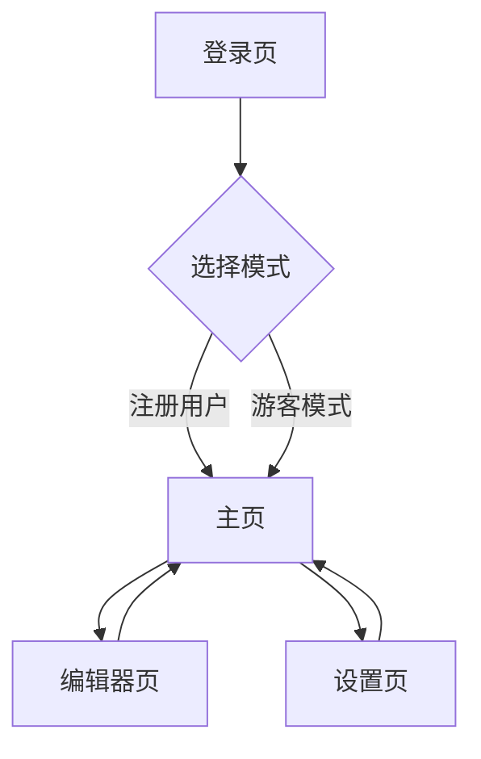

## 1. 产品概述

NoteNote是一款面向开发者的现代化笔记应用，支持Web和移动端，提供富文本编辑、云端同步和离线支持功能。通过免费的技术栈组合，让个人开发者能够零成本部署和使用。

## 2. 核心功能

### 2.1 用户角色

| 角色   | 注册方式       | 核心权限                  |
| ---- | ---------- | --------------------- |
| 普通用户 | 邮箱注册/第三方登录 | 创建、编辑、删除笔记，文件夹管理，标签管理 |
| 匿名用户 | 无需注册       | 本地笔记创建和编辑，无云端同步       |

### 2.2 功能模块

NoteNote包含以下主要页面：

1. **登录页**: 用户认证、第三方登录选项
2. **主页**: 笔记列表、文件夹树、搜索栏、快速新建
3. **编辑器页**: 富文本编辑器、工具栏、实时保存状态
4. **设置页**: 账户管理、同步设置、主题切换、导出选项

### 2.3 页面详情

| 页面名称 | 模块名称 | 功能描述                                |
| ---- | ---- | ----------------------------------- |
| 登录页  | 认证模块 | 支持邮箱/密码登录，Google/GitHub第三方登录，游客模式进入 |
| 主页   | 侧边栏  | 显示文件夹树结构，支持拖拽排序，快速筛选标签              |
| 主页   | 笔记列表 | 卡片式展示笔记，支持搜索、排序、批量操作                |
| 主页   | 工具栏  | 新建笔记、新建文件夹、导入导出功能                   |
| 编辑器页 | 编辑器  | 支持Markdown和富文本编辑，实时预览，图片拖拽上传        |
| 编辑器页 | 状态栏  | 显示保存状态、字数统计、最后修改时间                  |
| 设置页  | 账户设置 | 修改个人信息、更改密码、管理第三方登录                 |
| 设置页  | 同步设置 | 手动/自动同步开关，同步频率设置，离线数据管理             |
| 设置页  | 主题设置 | 主题色系切换（高级灰黄/高级灰蓝/高级灰绿等），圆角样式调整 |

## 3. 核心流程

用户操作流程：

1. 新用户可选择注册或直接以游客模式使用
2. 登录后进入主页，可浏览、创建、编辑笔记
3. 编辑器支持实时保存，自动同步到云端
4. 离线状态下可正常使用，联网后自动同步

## 4. 用户界面设计

### 4.1 设计风格

* **主题色系**: 默认高级灰黄色系（暖灰+柔和黄色点缀），支持切换多种高级灰色系主题

* **按钮样式**: 大圆角设计（8-12px圆角），主要操作为毛玻璃效果按钮，悬停丝滑过渡

* **字体**: Inter字体，标题18px，正文14px，字重层次分明

* **布局**: 左侧边栏+右侧内容区的经典布局，卡片式模块设计

* **图标**: 使用Lucide React图标库，线条圆润风格

* **交互动画**: 所有交互元素配备丝滑过渡动画，页面切换流畅自然

* **圆角设计**: 全局采用大圆角设计，卡片、按钮、输入框均为圆润造型

* **毛玻璃效果**: 使用半透明背景叠加模糊效果（`backdrop-filter: blur()`）体现高级感，避免生硬的颜色渐变

* **视觉层次**: 通过毛玻璃效果处理图层过渡，使用细微的半透明边框配合模糊背景

### 4.2 页面设计

| 页面名称 | 模块名称 | UI元素               |
| ---- | ---- | ------------------ |
| 登录页  | 认证表单 | 居中卡片布局，高级灰黄配色，圆润输入框，毛玻璃背景效果  |
| 主页   | 侧边栏  | 暖灰背景，可折叠，树形文件夹结构，圆角设计，毛玻璃悬浮效果   |
| 主页   | 笔记列表 | 卡片网格布局，悬停放大效果，标签柔和配色，毛玻璃卡片背景 |
| 编辑器页 | 编辑器  | 浅色背景，工具栏圆润按钮，实时字数统计，毛玻璃工具栏  |
| 设置页  | 主题卡片 | 圆形主题预览卡片，悬停放大效果，选中状态动画，毛玻璃卡片 |

### 4.3 响应式设计

* 桌面端优先设计，支持1280px以上屏幕

* 平板端自适应，侧边栏可收起

* 移动端采用底部导航+全屏编辑模式

### 4.4 离线支持

* 使用IndexedDB存储本地数据

* 离线状态指示器显示当前状态

* 同步冲突时提供手动合并选项