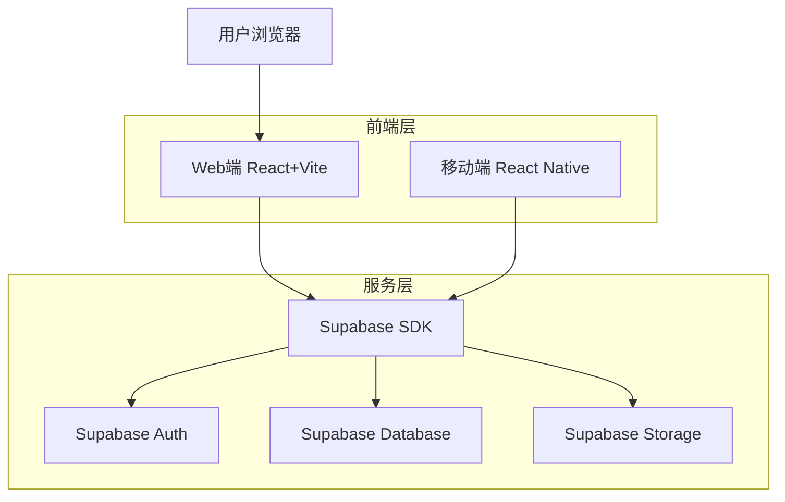
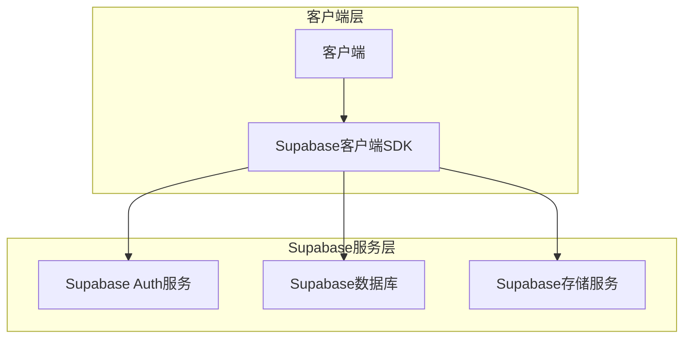
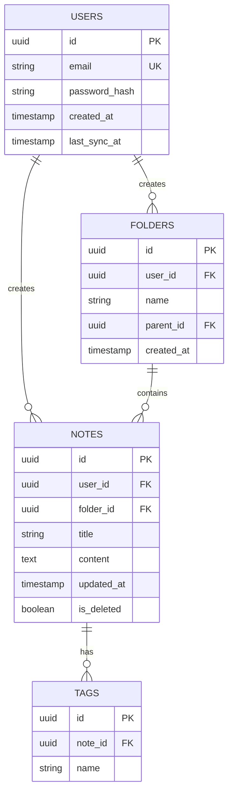

## 1. 架构设计



## 2. 技术描述

- **前端**: React@18 + TypeScript + TailwindCSS@3 + Vite + Framer Motion
- **移动端**: React Native + Expo + TypeScript
- **初始化工具**: Turborepo (Monorepo管理)
- **包管理**: pnpm
- **后端**: Supabase (免费额度)
- **数据库**: PostgreSQL (Supabase提供)
- **存储**: Supabase Storage (文件存储)
- **动画库**: Framer Motion (丝滑交互动画)

## 3. 路由定义

| 路由 | 用途 |
|------|------|
| / | 登录页，用户认证入口 |
| /home | 主页，笔记列表和管理 |
| /editor/:id | 编辑器页，创建/编辑笔记 |
| /settings | 设置页，账户和同步设置 |
| /folder/:id | 文件夹视图，筛选特定文件夹笔记 |

## 4. API定义

### 4.1 笔记相关API

**获取笔记列表**
```
GET /api/notes
```

请求参数：
| 参数名 | 参数类型 | 是否必需 | 描述 |
|--------|----------|----------|------|
| folder_id | string | 否 | 文件夹ID，用于筛选 |
| tag | string | 否 | 标签名称，用于筛选 |
| search | string | 否 | 搜索关键词 |

响应：
```json
{
  "notes": [
    {
      "id": "uuid",
      "title": "string",
      "content": "string",
      "folder_id": "string",
      "tags": ["string"],
      "updated_at": "timestamp",
      "is_synced": "boolean"
    }
  ]
}
```

**创建/更新笔记**
```
POST /api/notes
```

请求体：
```json
{
  "title": "string",
  "content": "string",
  "folder_id": "string",
  "tags": ["string"]
}
```

### 4.2 文件夹相关API

**获取文件夹树**
```
GET /api/folders
```

响应：
```json
{
  "folders": [
    {
      "id": "uuid",
      "name": "string",
      "parent_id": "string|null",
      "note_count": "number"
    }
  ]
}
```

## 5. 服务器架构



## 6. 数据模型

### 6.1 数据库设计



### 6.2 数据定义语言

**用户表 (users)**
```sql
-- 创建表
CREATE TABLE users (
    id UUID PRIMARY KEY DEFAULT gen_random_uuid(),
    email VARCHAR(255) UNIQUE NOT NULL,
    password_hash VARCHAR(255) NOT NULL,
    created_at TIMESTAMP WITH TIME ZONE DEFAULT NOW(),
    last_sync_at TIMESTAMP WITH TIME ZONE DEFAULT NOW()
);

-- 授权
GRANT SELECT ON users TO anon;
GRANT ALL PRIVILEGES ON users TO authenticated;
```

**笔记表 (notes)**
```sql
-- 创建表
CREATE TABLE notes (
    id UUID PRIMARY KEY DEFAULT gen_random_uuid(),
    user_id UUID NOT NULL REFERENCES users(id) ON DELETE CASCADE,
    folder_id UUID REFERENCES folders(id) ON DELETE SET NULL,
    title VARCHAR(255) NOT NULL,
    content TEXT,
    updated_at TIMESTAMP WITH TIME ZONE DEFAULT NOW(),
    is_deleted BOOLEAN DEFAULT FALSE
);

-- 创建索引
CREATE INDEX idx_notes_user_id ON notes(user_id);
CREATE INDEX idx_notes_folder_id ON notes(folder_id);
CREATE INDEX idx_notes_updated_at ON notes(updated_at DESC);

-- 授权
GRANT SELECT ON notes TO anon;
GRANT ALL PRIVILEGES ON notes TO authenticated;
```

**文件夹表 (folders)**
```sql
-- 创建表
CREATE TABLE folders (
    id UUID PRIMARY KEY DEFAULT gen_random_uuid(),
    user_id UUID NOT NULL REFERENCES users(id) ON DELETE CASCADE,
    name VARCHAR(100) NOT NULL,
    parent_id UUID REFERENCES folders(id) ON DELETE CASCADE,
    created_at TIMESTAMP WITH TIME ZONE DEFAULT NOW()
);

-- 创建索引
CREATE INDEX idx_folders_user_id ON folders(user_id);
CREATE INDEX idx_folders_parent_id ON folders(parent_id);

-- 授权
GRANT SELECT ON folders TO anon;
GRANT ALL PRIVILEGES ON folders TO authenticated;
```

## 7. 免费部署方案

### 7.1 前端部署
- **Vercel**: 免费额度足够个人项目使用，支持自动部署
- **Netlify**: 同样提供免费静态网站托管
- **GitHub Pages**: 完全免费，适合开源项目

### 7.2 后端服务
- **Supabase免费额度**: 
  - 500MB数据库空间
  - 每月50,000次实时连接
  - 1GB文件存储
  - 50,000次云函数调用
  - 完全满足个人使用需求

### 7.3 移动端构建
- **Expo**: 免费构建服务，支持直接发布到应用商店
- **本地构建**: 使用Expo CLI本地构建IPA/APK文件

### 7.4 成本估算
- 前端托管: $0/月 (Vercel免费版)
- 后端服务: $0/月 (Supabase免费版)
- 域名: $10/年 (可选)
- **总计: 基本使用完全免费**

### 7.5 主题管理方案

**基于TailwindCSS变量的主题系统**

```css
/* 默认高级灰黄色系 */
:root {
  --color-primary: #f59e0b;      /* 柔和黄色 */
  --color-secondary: #f3f4f6;    /* 浅灰色 */
  --color-background: #ffffff;   /* 白色背景 */
  --color-surface: #f9fafb;     /* 表面色 */
  --color-text: #1f2937;        /* 文字色 */
  --radius-sm: 0.375rem;        /* 小圆角 */
  --radius-md: 0.5rem;           /* 中圆角 */
  --radius-lg: 0.75rem;          /* 大圆角 */
  --radius-xl: 1rem;             /* 超大圆角 */
  --glass-bg: rgba(255, 255, 255, 0.1);  /* 毛玻璃背景色 */
  --glass-border: rgba(255, 255, 255, 0.2);  /* 毛玻璃边框色 */
  --glass-blur: 12px;            /* 模糊程度 */
}

/* 毛玻璃效果工具类 */
.glass {
  background: var(--glass-bg);
  backdrop-filter: blur(var(--glass-blur));
  -webkit-backdrop-filter: blur(var(--glass-blur));
  border: 1px solid var(--glass-border);
  border-radius: var(--radius-lg);
}

.glass-hover:hover {
  background: rgba(255, 255, 255, 0.15);
  transition: all 0.3s ease;
}
```

**TailwindCSS毛玻璃配置**

```javascript
// tailwind.config.js
module.exports = {
  theme: {
    extend: {
      backdropBlur: {
        xs: '2px',
        sm: '4px',
        DEFAULT: '12px',
        lg: '16px',
        xl: '24px',
      },
      backgroundOpacity: {
        '10': '0.1',
        '15': '0.15',
        '20': '0.2',
        '25': '0.25',
      },
      borderOpacity: {
        '10': '0.1',
        '15': '0.15',
        '20': '0.2',
      }
    }
  }
}
```

**使用示例**
```jsx
// 毛玻璃卡片
<div className="bg-white/10 backdrop-blur-md border border-white/20 rounded-xl p-6">
  <h3 className="text-white font-semibold">毛玻璃效果卡片</h3>
  <p className="text-white/80 mt-2">使用半透明背景和模糊效果</p>
</div>

// 毛玻璃按钮
<button className="bg-white/15 backdrop-blur-sm border border-white/25 rounded-lg px-4 py-2 hover:bg-white/20 transition-all duration-300">
  毛玻璃按钮
</button>

// 毛玻璃侧边栏
<aside className="bg-gray-900/10 backdrop-blur-lg border-r border-white/10 h-full">
  <div className="p-4">
    <h2 className="text-white font-bold mb-4">侧边栏</h2>
    <nav className="space-y-2">
      <a href="#" className="block p-2 rounded-lg bg-white/10 backdrop-blur-sm border border-white/20 hover:bg-white/15 transition-all">
        导航项
      </a>
    </nav>
  </div>
</aside>
```

**Framer Motion动画配置**
```typescript
// 页面切换动画
const pageTransition = {
  initial: { opacity: 0, y: 20 },
  animate: { opacity: 1, y: 0 },
  exit: { opacity: 0, y: -20 },
  transition: { duration: 0.3, ease: "easeInOut" }
};

// 毛玻璃按钮悬停动画
const glassButtonHover = {
  scale: 1.02,
  backgroundColor: "rgba(255, 255, 255, 0.15)",
  transition: { duration: 0.2, ease: "easeOut" }
};

// 毛玻璃卡片悬停动画
const glassCardHover = {
  scale: 1.01,
  y: -2,
  backgroundColor: "rgba(255, 255, 255, 0.12)",
  transition: { duration: 0.3, ease: "easeOut" }
};

// 毛玻璃效果动画
const glassVariants = {
  initial: { 
    opacity: 0,
    backdropFilter: "blur(0px)",
    backgroundColor: "rgba(255, 255, 255, 0.05)"
  },
  animate: { 
    opacity: 1,
    backdropFilter: "blur(12px)",
    backgroundColor: "rgba(255, 255, 255, 0.1)",
    transition: { duration: 0.5, ease: "easeOut" }
  }
};
```